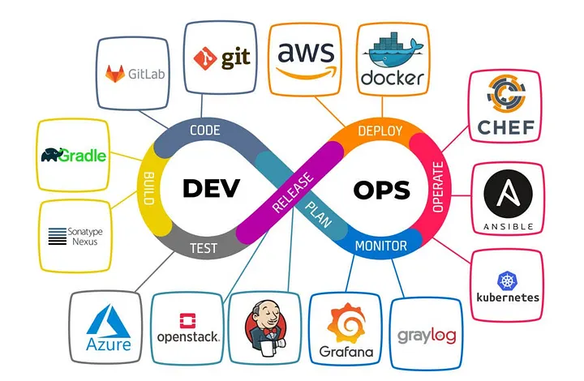

# **Understanding DevOps**

<strong>📋 Table of Contents</strong>

- [**Understanding DevOps**](#understanding-devops)
  - [1. The Story of an IT Company 🏢](#1-the-story-of-an-it-company-)
  - [2. The Key Players and Their Challenges 🧑‍💻👩‍💼](#2-the-key-players-and-their-challenges-)
  - [3. The CEO's Dilemma and The Solution 🤔](#3-the-ceos-dilemma-and-the-solution-)
  - [4. What is DevOps? 💡](#4-what-is-devops-)
  - [5. Why DevOps Matters 📈](#5-why-devops-matters-)
  - [6. The DevOps Lifecycle 🔄](#6-the-devops-lifecycle-)
  - [7. Continuous Integration and Continuous Delivery (CI/CD) 🔗](#7-continuous-integration-and-continuous-delivery-cicd-)
  - [8. The Benefits of Adopting DevOps ✨](#8-the-benefits-of-adopting-devops-)

---

 

  

## 1. The Story of an IT Company 🏢

**TechnoSphere Solutions** is a mid-sized IT company that develops custom software and cloud solutions for various clients. During the COVID pandemic, their business skyrocketed, and they were challenged to scale their development and operations very rapidly. The company started with the **waterfall model** of development 10 years ago and has been using the **agile model** for the last five years. However, they are still struggling to keep up with client demand and the competitive marketplace.

---

## 2. The Key Players and Their Challenges 🧑‍💻👩‍💼

Meet **Kamran** from the development team and **Ayesha** from the operations team. The relationship between developers and IT operations is often adversarial.

**Challenges for Kamran (Developer):**
* Pressure for on-time delivery.
* Grappling with issue resolution.
* Implementing new application capabilities.
* Ongoing need for code management.
* Long and slow software release cycles.

**Challenges for Ayesha (Operations):**
* Resource contention.
* Analysis and diagnostic checks.
* Fast issue resolution.
* Constant demand for redesign.
* Keeping up with client requests to edit or tweak.

When a client complains about software, the teams internally throw blame at each other. For example, **Kamran** would claim the code worked perfectly on his machine, while **Ayesha** would argue that **Kamran's** code was improper and broke in the production environment. A developer wants frequent changes to be pushed to production, while operations want a stable production environment. The business, however, needs both: quick changes and stability at the same time.

---

## 3. The CEO's Dilemma and The Solution 🤔

Meet **Fariha**, the CEO of TechnoSphere Solutions. She knows her teams are struggling and working in silos, which negatively impacts the company. She makes a call to a consultant, **Hassan**, and shares her specific concerns:
* Deployment delays.
* High operational costs.
* Communication issues.
* Problems with security.
* High failure rates.
* Erratic code execution.
* No plan for continuous integration.

**Hassan** listens patiently and offers a solution. He introduces **Fariha** to the **DevOps** philosophy, explaining how modern DevOps practices can solve her company's problems.

---

## 4. What is DevOps? 💡

**DevOps** is a way of working that allows for **continuous delivery**. It's a fundamental change in IT culture focused on rapid IT service delivery.

* **Collaboration:** DevOps encourages collaboration between previously siloed teams like development and operations.
* **Automation:** It leverages automation tools to create a programmable and dynamic infrastructure, which increases the pace of releases and improves the product faster.
* **Continuous Culture:** It represents a paradigm shift that allows companies to adopt agile and lean practices to deliver services rapidly.

---

## 5. Why DevOps Matters 📈

DevOps brings development and operations teams together to create a unified infrastructure. This collaboration helps to:
* Maximize **productivity**.
* Simplify the software production lifecycle.
* Improve release and deployment frequency.
* Maximize **predictability**, **efficiency**, and **security**.
* Find bugs early in the software development lifecycle.

---

## 6. The DevOps Lifecycle 🔄

The DevOps lifecycle is a rapid, multi-phased software development lifecycle. It's test-driven to ensure robust software and has a strong feedback loop. The code is continuously built, tested, released, and monitored.

The 8 phases are:
* **On the Dev side:** Plan, Code, Build, Test.
* **On the Operations side:** Release, Deploy, Operate, Monitor.

---

## 7. Continuous Integration and Continuous Delivery (CI/CD) 🔗

* **Agile Development:** Covers the **plan, code, and build** phases, organizing work in short iterations called sprints to increase the number of releases.
* **Continuous Integration (CI):** Requires developers to integrate their work as early as possible. This helps to regularly expose bugs and issues.
* **Continuous Delivery (CD):** Provides the tools and best practices to deliver quickly. At the end of each CI build, the software is delivered for QA testing and then for delivery to the production environment.

**DevOps** is the complete end-to-end business solution that encompasses the entire lifecycle, including Continuous Operation and Monitoring. It is a paradigm shift that brings continuity to every stage.

---

## 8. The Benefits of Adopting DevOps ✨

DevOps provides several benefits by supporting the entire software development lifecycle with an emphasis on agility and efficiency.

* **Improved Culture:** Teams are more connected, leading to greater employee engagement, collaboration, and professional growth opportunities.
* **Tighter Technicality:** Results in improved software quality, quick problem resolution, and greater stability and reliability.
* **Better Business Yields:** Leads to lower IT costs, quicker delivery times, more predictability, and heightened innovation.

In conclusion, DevOps effectively serves the purpose of reducing the time involved in the software development lifecycle, leading to prompt deliveries and the continuous production of high-quality, foolproof software applications.