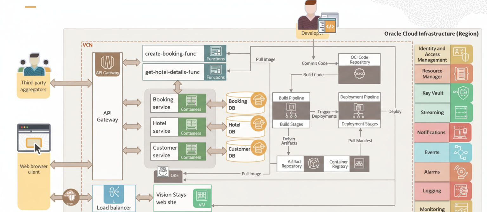

# **DevOps case Study 2**

  

## Architecture Blueprint
The Vision Stays application is designed as a cloud native solution with the following key components and OCI services:

### 1. **Microservices Architecture**
The core of the application consists of three microservices:
- **Customer Service**: Manages and stores customer details.
- **Hotel Service**: Handles information related to Vision Stays hotels.
- **Booking Service**: Processes reservation bookings.

These microservices are independent, enabling scalability, agility, and maintainability.

### 2. **Containerization with OCI Container Engine for Kubernetes (OKE)**
- Each microservice is containerized and deployed in a Kubernetes cluster managed by **OCI Container Engine for Kubernetes (OKE)**.
- OKE provides:
  - **Automated Provisioning**: Simplifies container setup.
  - **Scaling**: Adjusts resources based on demand.
  - **Orchestration**: Coordinates multiple containers for seamless operation.

### 3. **Oracle Functions for Third-Party Integration**
- Two serverless **Oracle Functions** are implemented to support third-party vendors:
  - **create-booking-function**: Facilitates booking creation.
  - **get-hotel-details-function**: Provides hotel details to external systems.
- These functions are secured and managed through **OCI API Gateway**, which:
  - Acts as a centralized entry point for secure and efficient request handling.
  - Provides authentication, authorization, rate limiting, and traffic routing.

### 4. **Data Storage with Autonomous JSON Database**
- All data generated by the microservices is stored in **Oracle Autonomous JSON Database** instances.
- This fully managed database offers:
  - Automatic provisioning, scaling, and patching.
  - High availability and performance with minimal operational overhead.

### 5. 
- The website’s front end is hosted on an **OCI Compute Virtual Machine (VM) Instance**, ensuring relia**Front-End Hosting**ble performance.
- An **OCI Load Balancer** distributes incoming traffic across multiple VM instances to enhance:
  - Scalability
  - Availability
  - Responsiveness
- Load Balancer features include SSL termination, session persistence, and content-based routing.

### 6. **Security with Web Application Firewall (WAF) and OCI Vault**
- **OCI Web Application Firewall (WAF)** protects the website from common threats (e.g., SQL injection, cross-site scripting) to ensure robust security.
- **OCI Vault** securely stores sensitive credentials (e.g., database passwords) with encryption.

### 7. **CI/CD with OCI DevOps**
- The development-to-deployment process is automated using **OCI DevOps Project** and **Resource Manager**.
- **CI/CD Pipeline Workflow**:
  - Code commits are pushed to the **OCI DevOps Code Registry**.
  - Build triggers initiate automated build runs to create new artifacts or container images.
  - These assets are stored in the **OCI Artifact Registry** and **Container Registry**.
  - Deployment pipelines pull the latest artifacts/images for seamless deployment.
- **Deployment Strategies**:
  - **Blue-Green Deployments**: Ensures zero downtime during updates.
  - **Canary Deployments**: Tests new versions on a small user base for reliability.

### 8. **Notifications and Streaming**
- The **Booking Service** uses:
  - **OCI Notification Service**: Sends email notifications to the hotel administration for new bookings.
  - **OCI Streaming Service**: Stores messages for downstream analysis.

### 9. **Observability with Monitoring, Alerting, and Logging**
- **OCI Event Service** enables:
  - Triggering code execution via Oracle Functions.
  - Writing to the Streaming Service or sending alerts via Notifications.
  - Intelligent automation for infrastructure changes.
- **Monitoring Tools** track metrics like:
  - CPU and memory utilization.
  - Network traffic.
  - Response times.
- **Alerting Mechanisms** notify personnel of anomalies or critical issues.
- **Logging Systems** capture detailed application events and user interactions, enabling:
  - Thorough analysis and troubleshooting.
  - Insights into user behavior and system performance.

