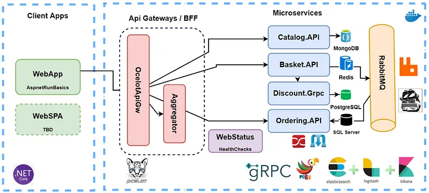

# **Microservices Architecture: Overview**
 

<strong>📋 Table of Contents</strong>

- [**Microservices Architecture: Overview**](#microservices-architecture-overview)
  - [What Are Microservices?](#what-are-microservices)
    - [Key Characteristics of Microservices](#key-characteristics-of-microservices)
  - [Microservices Architecture in an E-Commerce Application](#microservices-architecture-in-an-e-commerce-application)
  - [Microservices vs. Monolithic Architecture](#microservices-vs-monolithic-architecture)
    - [Monolithic Architecture](#monolithic-architecture)
    - [Microservices Architecture](#microservices-architecture)
    - [Detailed Comparison](#detailed-comparison)
  - [Communication Mechanisms in Microservices](#communication-mechanisms-in-microservices)
    - [Communication Styles](#communication-styles)
    - [Considerations for Communication](#considerations-for-communication)
  - [Conclusion](#conclusion)

   

  

## What Are Microservices?

Microservices refer to an approach in software development where application functionality is broken down into individual, independently deployable components. These components, or microservices, communicate via Application Programming Interfaces (APIs). This architectural style leverages integration, API management, and cloud deployment technologies, enabling developers to develop and deploy services independently based on specific requirements.

### Key Characteristics of Microservices

- **Multilingual Development**: Microservices allow applications to be built using multiple programming languages and technologies. This enables teams to work independently, choosing the best tools for their specific tasks. For example, one developer might use Node.js for a feature, while another uses Python, without impacting the overall architecture.

- **Loosely Coupled**: Microservices operate in a loosely coupled environment, meaning they are less dependent on each other. This isolation allows developers to address performance issues or slowdowns in one service without affecting others, improving productivity.

- **Easy to Maintain and Independently Deployable**: Because microservices are isolated, their codebases are smaller and easier to maintain. Changes can be made to specific services and deployed independently, without requiring a full application redeployment.

- **Easily Scalable and Highly Available**: Microservices can be scaled independently without relying on third-party services. High availability can be achieved through techniques like load balancing and API gateways, though maintaining it requires careful design.

- **Failure Resistant**: By incorporating fault tolerance policies, microservices can be designed to limit the impact of failures. For example, in a movie ticket application, separate microservices for scheduling, purchasing, and customer preferences can fail independently without bringing down the entire system.

## Microservices Architecture in an E-Commerce Application

Consider a sample e-commerce application built using microservices. The architecture typically consists of three layers:

1. **API Layer**: The entry point for client requests, enabling communication between microservices using protocols like HTTP, gRPC, or other TCP/UDP protocols.

2. **Logic Layer**: Each microservice focuses on a single business task, minimizing dependencies. For example, an e-commerce application might have microservices written in Java, Python, and Go, showcasing the multilingual nature of the architecture.

3. **Data Store Layer**: Each microservice can have its own persistence mechanism, such as a database or log files. For instance, one microservice might use a dedicated database, while another uses a different data store, ensuring decentralization.

Microservices are typically deployed in containers, which provide lightweight runtime environments. These containers can be scaled up or down based on demand and managed using orchestration tools like Kubernetes.

## Microservices vs. Monolithic Architecture

### Monolithic Architecture

In a monolithic architecture, the entire application is built as a single unit, encompassing the user interface, business logic, and data access layer. These components share the same resources and database, making them highly dependent on each other. If one component fails, the entire application may stop functioning.

### Microservices Architecture

In contrast, microservices organize business logic into multiple, loosely coupled services. Each service operates independently with its own resources and database, ensuring that a failure in one service does not affect others.

### Detailed Comparison

| **Aspect**                     | **Microservices Architecture**                                                                 | **Monolithic Architecture**                                                                 |
|--------------------------------|---------------------------------------------------------------------------------------------|-------------------------------------------------------------------------------------------|
| **Unit Design**                | Loosely coupled services, developed and deployed independently.                              | Single instance containing all services, tightly coupled.                                  |
| **Functionality Reuse**        | Exposes functionality via APIs, accessible to other clients or services.                    | Limited functionality reuse, often requiring code duplication.                             |
| **Communication**              | Uses REST APIs over HTTP, gRPC, or other protocols for inter-service communication.         | Relies on internal procedure and function calls within the same codebase.                  |
| **Technological Flexibility**   | Supports multiple programming languages and frameworks tailored to specific needs.          | Requires a single programming language for the entire application.                         |
| **Data Management**            | Decentralized, with each microservice managing its own data store.                          | Centralized database shared across all components.                                         |
| **Deployment**                 | Independent deployment of individual services.                                             | Entire application must be deployed as a single unit.                                      |
| **Maintainability**            | Easier to maintain due to smaller, isolated codebases.                                      | Complex to maintain due to a single, large codebase.                                       |
| **Resiliency/Fault Tolerance** | High resilience; failures are isolated to individual services.                             | Low resilience; a single failure can crash the entire application.                         |
| **Scalability**                | Individual services can be scaled independently.                                           | Entire application must be scaled as a single unit.                                        |

## Communication Mechanisms in Microservices

Microservices are distributed by nature, requiring inter-service communication over a network. Each microservice runs as an independent instance, interacting via protocols such as:

- **HTTP/HTTPS**: Commonly used for REST API calls.
- **gRPC**: A high-performance, binary format protocol ideal for internal microservice communication.
- **Message Brokers**: Protocols like AMQP (Advanced Message Queuing Protocol) are used with systems like Kafka or RabbitMQ for asynchronous communication.

### Communication Styles

Microservices communication can be classified based on two criteria:

1. **Protocol Type**:
   - **Synchronous**: Uses protocols like HTTP, HTTPS, or gRPC, where the client sends a request and waits for a response. This can lead to thread blocking until the response is received.
   - **Asynchronous**: Uses protocols like AMQP, where the client sends a message via a message broker without waiting for an immediate response. This is compatible with various operating systems and cloud environments.

2. **Number of Receivers**:
   - **Single Receiver**: Each request is processed by one service, often following a command pattern.
   - **Multiple Receivers**: Event-driven architectures use message brokers or event buses to broadcast updates to multiple services.

### Considerations for Communication

- **Network Traffic**: Inter-service communication generates significant network traffic, making serialization, speed, and payload size critical. gRPC is often preferred for internal communication due to its efficiency.
- **Common Patterns**: The most common communication style is single-receiver, asynchronous communication using HTTP/HTTPS. However, hybrid approaches combining synchronous and asynchronous styles are also prevalent.

## Conclusion

Microservices architecture offers a flexible, scalable, and resilient approach to software development by breaking applications into loosely coupled, independently deployable services. Unlike monolithic architectures, microservices enable multilingual development, decentralized data management, and fault isolation, making them easier to maintain and scale. Effective communication mechanisms, such as HTTP, gRPC, and AMQP, are critical to their success, with considerations for protocol type and receiver patterns shaping their design.

This overview highlights the core principles of microservices, their advantages over monolithic architectures, and the communication strategies that enable their functionality. Hopefully, this provides a clear understanding of microservices and their role in modern software development.