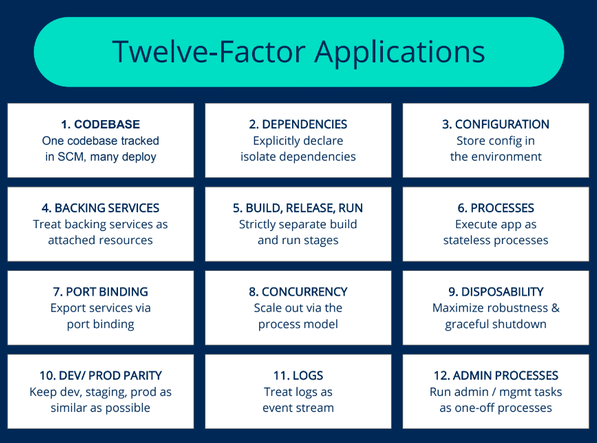

# **The 12-Factor App Methodology and Benefits of Microservices**

<b>📋 Table of Contents</b>

- [**The 12-Factor App Methodology and Benefits of Microservices**](#the-12-factor-app-methodology-and-benefits-of-microservices)
  - [Introduction to the 12-Factor App Methodology](#introduction-to-the-12-factor-app-methodology)
  - [The 12 Factors](#the-12-factors)
    - [1. Codebase](#1-codebase)
    - [2. Dependencies](#2-dependencies)
    - [3. Configuration](#3-configuration)
    - [4. Backing Services](#4-backing-services)
    - [5. Build, Release, Run](#5-build-release-run)
    - [6. Processes](#6-processes)
    - [7. Port Binding](#7-port-binding)
    - [8. Concurrency](#8-concurrency)
    - [9. Disposability](#9-disposability)
    - [10. Dev/Prod Parity](#10-devprod-parity)
    - [11. Logs](#11-logs)
    - [12. Admin Processes](#12-admin-processes)
  - [Benefits of Microservices Architecture](#benefits-of-microservices-architecture)
    - [1. Loosely Coupled Components](#1-loosely-coupled-components)
    - [2. Business-Oriented Design](#2-business-oriented-design)
    - [3. Multilingual Development](#3-multilingual-development)
    - [4. Increased Fault Tolerance and Isolation](#4-increased-fault-tolerance-and-isolation)
    - [5. Greater Scalability and Flexibility](#5-greater-scalability-and-flexibility)
    - [6. Simplified Security Monitoring](#6-simplified-security-monitoring)
    - [7. Autonomous, Cross-Functional Teams](#7-autonomous-cross-functional-teams)
  - [Drawbacks of Microservices Architecture](#drawbacks-of-microservices-architecture)
    - [1. Increased Complexity](#1-increased-complexity)
    - [2. Higher Costs](#2-higher-costs)
    - [3. Debugging Challenges](#3-debugging-challenges)
    - [4. Difficult Global Testing](#4-difficult-global-testing)
  - [Conclusion](#conclusion)

 

  

## Introduction to the 12-Factor App Methodology

The 12-factor app methodology, developed by Heroku in 2011, is a set of 12 best practices for building applications designed to run as services. These principles align closely with microservices architecture, making them highly relevant for modern software development. Below, we explore each of the 12 factors, followed by the benefits and drawbacks of microservices architecture.

## The 12 Factors

### 1. Codebase
   - **Principle**: Each application should have a single codebase tracked in a version control system, such as a Git repository, and must not share its repository with other applications.
   - **Microservices Alignment**: In microservices, each service has its own codebase, simplifying Continuous Integration/Continuous Deployment (CI/CD) processes by allowing independent development and deployment.

### 2. Dependencies
   - **Principle**: Application dependencies should be explicitly declared and managed using package managers (e.g., Maven, Gradle, or SBT). For example, Maven uses a Project Object Model (POM) XML file to define dependencies. In non-containerized environments, tools like Chef or Ansible can manage system-level dependencies, while Dockerfiles are used in containerized setups.
   - **Microservices Alignment**: Clear dependency management ensures each microservice can operate independently with its required libraries.

### 3. Configuration
   - **Principle**: Configurations should be externalized from the codebase and stored as environment variables, read by the application at runtime. This eliminates the need to modify and redeploy the codebase when configuration changes are required.
   - **Microservices Alignment**: Tools like Ansible or Chef can automate configuration management, making updates seamless and reducing deployment overhead.

### 4. Backing Services
   - **Principle**: Applications should treat backing services (e.g., databases, APIs) as attached resources that can be swapped without code changes. For example, switching from an on-premises MySQL database to OCI Database Cloud Service should only require a configuration update.
   - **Microservices Alignment**: This flexibility supports the independent nature of microservices, allowing easy integration with different providers.

### 5. Build, Release, Run
   - **Principle**: Strictly separate the build, release, and run stages. CI/CD tools automate these processes, and Docker images can be used to create deployment artifacts for each commit.
   - **Microservices Alignment**: This separation ensures that microservices can be built, tested, and deployed independently, improving deployment efficiency.

### 6. Processes
   - **Principle**: Applications should be stateless, following REST principles, to enable horizontal scaling. State should be stored in external resources like Redis, Memcached, or DataStore, rather than in-memory or on-disk.
   - **Microservices Alignment**: Stateless processes allow microservices to scale without impacting other services, ensuring flexibility.

### 7. Port Binding
   - **Principle**: Applications should be self-contained, exposing services via port binding without relying on external web servers. Persistent data access should only occur through service APIs to avoid implicit dependencies.
   - **Microservices Alignment**: This promotes loose coupling by ensuring microservices communicate explicitly via APIs.

### 8. Concurrency
   - **Principle**: Favor horizontal scaling (adding more instances) over vertical scaling (adding more hardware). Containerization supports this by allowing easy replication of application instances.
   - **Microservices Alignment**: Horizontal scaling aligns with microservices' ability to scale individual services based on demand.

### 9. Disposability
   - **Principle**: Systems should handle the addition or removal of instances gracefully, minimizing impact. Containers inherently support this by allowing instant start/stop operations.
   - **Microservices Alignment**: Disposability ensures microservices can recover quickly from crashes, maintaining a valid state.

### 10. Dev/Prod Parity
 - **Principle**: Keep development, staging, and production environments as similar as possible to reduce bugs in later stages. Containers ensure consistent execution environments across all stages.   
- **Microservices Alignment**: Consistent environments support reliable testing and deployment for microservices.

### 11. Logs
- **Principle**: Treat logs as event streams, directing them to a centralized location rather than storing them in files. Observability and monitoring tools enhance visibility into application behavior.
- **Microservices Alignment**: Centralized logging is critical for troubleshooting and understanding user behavior in distributed microservices systems.

### 12. Admin Processes
- **Principle**: Separate administrative tasks (e.g., data cleanup, analytics, A/B testing) from the main application to prevent interference with running services.
- **Microservices Alignment**: Isolating admin tasks ensures that microservices remain focused on their core business logic.

## Benefits of Microservices Architecture

Microservices offer several advantages, particularly for large-scale or complex applications:

### 1. Loosely Coupled Components
   - Components can be developed, replaced, and scaled independently, simplifying maintenance and updates.

### 2. Business-Oriented Design
   - Microservices are organized around business capabilities, prioritizing user experience and customer satisfaction over technical constraints.

### 3. Multilingual Development
   - Teams can use different programming languages and frameworks, enabling flexibility and parallel development, which boosts productivity and deployment speed.

### 4. Increased Fault Tolerance and Isolation
   - Fallback mechanisms ensure that a failure in one microservice does not affect others, allowing the system to continue functioning.

### 5. Greater Scalability and Flexibility
   - Microservices can be scaled horizontally by duplicating specific services to address performance bottlenecks.

### 6. Simplified Security Monitoring
   - Isolated services make it easier to manage and monitor security, enabling faster identification and containment of threats.

### 7. Autonomous, Cross-Functional Teams
   - Teams can focus on specific microservices, working independently without needing to coordinate with the entire application, improving efficiency.

## Drawbacks of Microservices Architecture

Despite their advantages, microservices come with challenges:

### 1. Increased Complexity
   - Managing communication between dozens or hundreds of services can be complex, requiring secure and efficient inter-service interactions.

### 2. Higher Costs
   - Microservices require robust hosting infrastructure, security, and maintenance support. Skilled development teams are needed to manage these services, and organizations must adopt a mature DevOps and agile culture.

### 3. Debugging Challenges
   - With multiple services and separate logs, tracing the source of issues can be difficult, complicating debugging efforts.

### 4. Difficult Global Testing
   - While unit testing is easier, integration testing is challenging due to the distributed nature of microservices, making end-to-end testing complex.

## Conclusion

The 12-factor app methodology provides a robust framework for building scalable, maintainable, and resilient applications, aligning seamlessly with microservices principles. Microservices architecture offers significant benefits, including loose coupling, scalability, and fault tolerance, but it also introduces complexities in communication, debugging, and testing. Organizations must evaluate whether this approach suits their culture and goals, as it is particularly effective for large companies or complex business domains. By adhering to the 12-factor principles and understanding the trade-offs, teams can leverage microservices to build flexible and efficient systems.