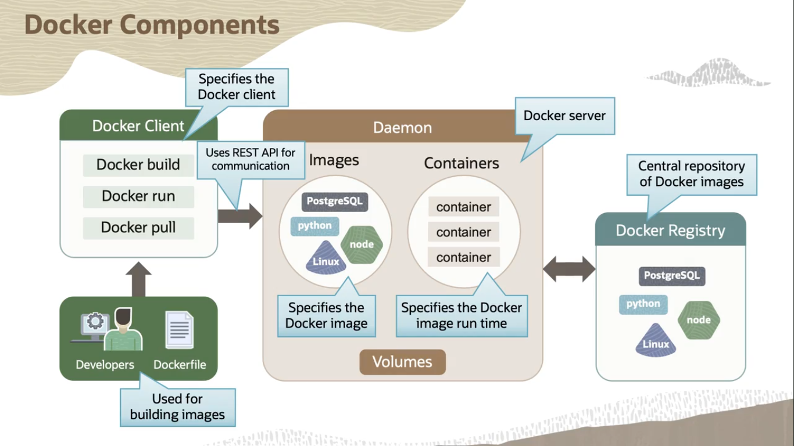

# **Docker Components and Architecture**

📋 Table of Contents

- [**Docker Components and Architecture**](#docker-components-and-architecture)
  - [Overview of Docker Components](#overview-of-docker-components)
  - [Docker Components](#docker-components)
  - [Containers vs. Virtual Machines](#containers-vs-virtual-machines)
    - [Virtual Machines (VMs)](#virtual-machines-vms)
    - [Containers](#containers)
  - [Key Docker Commands](#key-docker-commands)
  - [Conclusion](#conclusion)

 

Docker Components

  

## Overview of Docker Components

Docker is a powerful containerization platform that enables developers to create, deploy, and manage applications in lightweight, portable containers. The Docker architecture consists of several components that work together to achieve containerization goals. Below, we explore these components, compare containers to virtual machines, and outline key Docker commands.

## Docker Components

1. **Docker Client**
   - The Docker client is the primary interface for developers or DevOps professionals to interact with the Docker engine. It can run on the same machine as the Docker engine (e.g., in development environments) or connect remotely via a shell.
   - The client sends commands to the Docker Daemon using REST APIs. A single Docker client can communicate with multiple Docker Daemons simultaneously.

2. **Docker Daemon**
   - The Docker Daemon is a persistent background process that manages core Docker objects, including:
     - Images
     - Containers
     - Networks
     - Storage volumes
   - It listens for Docker API requests from the Docker client and processes them to execute the requested operations.

3. **Docker Registries**
   - Docker registries are services that store and distribute Docker images. A registry contains repositories, each hosting one or more Docker images.
   - **Public Registries**: Examples include Docker Hub and Docker Cloud.
   - **Private Registries**: Organizations can host their own registries, such as Oracle Cloud Infrastructure Registry (OCIR), which supports both private and public repositories.

## Containers vs. Virtual Machines

### Virtual Machines (VMs)
- **Architecture**: VMs run on a hypervisor (software, firmware, or hardware) that sits between the hardware and the virtual machines. Each VM includes:
  - A full guest operating system
  - Binaries, libraries, and applications
- **Characteristics**:
  - VMs with different operating systems (e.g., Linux and Windows) can run on the same physical server.
  - Each VM is resource-intensive, often several gigabytes in size, due to the inclusion of a complete OS.
- **Benefits**:
  - Application consolidation on a single system
  - Cost savings through reduced physical footprint
  - Faster server provisioning
- **Drawbacks**:
  - High memory and storage overhead due to separate OS images
  - Increased complexity across the software development lifecycle (development, testing, production, and disaster recovery)
  - Limited portability across cloud providers and traditional data centers

### Containers
- **Architecture**: Containers run on top of a physical server and its host operating system (e.g., Linux or Windows). They share:
  - The host OS kernel
  - Binaries and libraries (in read-only mode)
- **Characteristics**:
  - Containers are lightweight, typically megabytes in size, and start in seconds.
  - They share OS resources, reducing the need to duplicate operating system code.
- **Benefits**:
  - Higher efficiency: A single server can run multiple workloads with one OS installation.
  - Greater density: Two to three times more applications can run on a server compared to VMs.
  - Enhanced portability: Containers run consistently across different environments (bare metal, VMs, or cloud).
- **Use Cases**:
  - Containers are ideal for most scenarios due to their lightweight nature, speed, and cost-effectiveness.
  - VMs are preferred when applications require a dedicated OS or when isolation and security are the top priorities.

## Key Docker Commands

Below are some essential Docker commands for managing containers:

1. **Create and Run a Container**:
   - **Command**: `docker run [image_name]`
   - **Description**: Creates and starts a container from the specified image. Additional parameters include:
     - `-p`: Map ports
     - `-d`: Run in detached mode

2. **Start a Stopped Container**:
   - **Command**: `docker start [container_name | container_id]`
   - **Description**: Starts a previously stopped container.

3. **Stop a Running Container**:
   - **Command**: `docker stop [container_name | container_id]`
   - **Description**: Stops a running container.

4. **Restart a Container**:
   - **Command**: `docker restart [container_name | container_id]`
   - **Description**: Restarts a running container.

5. **Inspect a Container**:
   - **Command**: `docker inspect [container_name | container_id]`
   - **Description**: Displays detailed information about a container.

6. **View Container Logs**:
   - **Command**: `docker logs [container_name | container_id]`
   - **Description**: Shows the logs of a container.

7. **List Containers**:
   - **Command**: `docker ps`
   - **Description**: Lists all running containers.
   - **Command**: `docker ps -a`
   - **Description**: Lists all containers, including stopped ones.

8. **Remove a Container**:
   - **Command**: `docker rm [container_name | container_id]`
   - **Description**: Deletes a container.

## Conclusion

Docker's architecture, comprising the Docker Client, Daemon, and Registries, enables efficient containerization, offering a lightweight and portable alternative to virtual machines. Containers reduce overhead, improve resource utilization, and enhance application portability across diverse environments. By leveraging key Docker commands, developers can effectively manage containers, streamlining the development and deployment process. Understanding these components and their advantages over traditional virtualization empowers teams to build scalable, agile, and cost-effective applications.